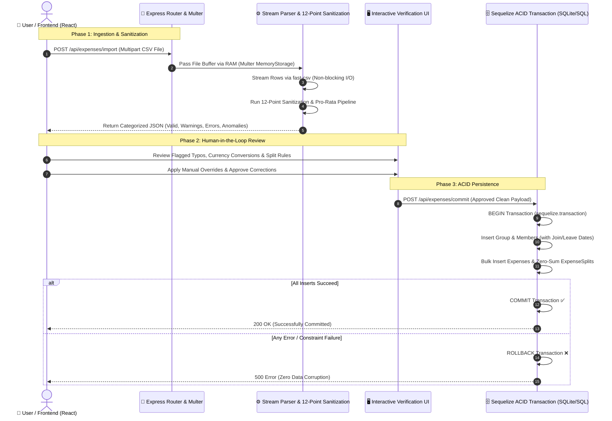

# 🏛️ End-to-End CSV Ingestion & Sanitization Engine: Architecture & Interview Guide

This document is tailored specifically for **Technical Interviews** and **System Design Whiteboard Sessions**. It explains the architecture, engineering decisions, algorithm design, and end-to-end data flow of our financial CSV uploading and processing engine.

---

## 📌 Executive Summary (The 30-Second Interview Pitch)
> *"We built an asynchronous, non-blocking financial CSV ingestion engine in Node.js and React that processes messy, human-generated expense sheets into mathematically precise, ACID-compliant database records. Instead of directly writing raw uploads to the database, we decouple the process into a **Two-Phase Architecture**: (1) An **In-Memory Streaming & 12-Point Sanitization Pipeline** that detects typos, currency exchanges, date anomalies, and temporal border exclusions, and (2) An interactive **Human-in-the-Loop Verification UI** followed by a **Zero-Sum Transactional Database Commit** that guarantees zero penny drift and strict ACID data integrity."*

---

## ✍️ Whiteboard Architecture Diagram (Draw This in Your Interview!)

When asked to *draw the architecture*, draw these 4 distinct layers and explain how data flows between them without touching the disk during validation:



---

## 🛠️ Key Architectural & Engineering Decisions (Why We Built It This Way)

### 1. Why `multer.memoryStorage()` over Disk Storage?
* **Interview Justification:** In standard file uploads, writing files to `/tmp` or disk introduces disk I/O bottlenecks and requires cleanup cron jobs for orphaned temporary files.
* **Our Approach:** Since CSV files for expense groups are typically under 10MB, we buffer the upload directly into RAM (`req.file.buffer`). This allows us to instantly pipe the memory buffer into our streaming parser with **zero disk latency** and zero file cleanup overhead.

### 2. Why Stream Parsing (`fast-csv`) over `readFileSync`?
* **Interview Justification:** Using synchronous file reading or `.toString().split('\n')` blocks the Node.js single-threaded Event Loop. If 50 users upload files simultaneously, the server freezes.
* **Our Approach:** We convert the memory buffer into a Node.js Readable Stream (`Readable.from(req.file.buffer)`) and pipe it into `fast-csv`. This processes the CSV row-by-row asynchronously, keeping the Event Loop responsive for other API endpoints.

### 3. Why Arbitrary-Precision Arithmetic (`Big.js`) over Standard Math?
* **Interview Justification:** JavaScript numbers use **IEEE 754 floating-point standard**. In financial apps, `0.1 + 0.2 === 0.30000000000000004`. When calculating splits or currency conversions, floating-point drift causes unbalanced ledgers and auditing failures.
* **Our Approach:** All numeric operations use `Big.js` with **Banker's Rounding (`Big.roundHalfUp` / Half-Even)**. This rounds exact halves to the nearest even number, minimizing cumulative statistical bias across thousands of transactions.

---

## 🔬 The 12-Point Sanitization & Business Logic Engine

Our core processing loop (`[csvSanitizer.js](file:///c:/Users/divya/OneDrive/Desktop/Expenses_App/backend/controllers/csvSanitizer.js)`) runs every row through a rigorous 12-point inspection before it ever reaches the database:

| # | Inspection / Rule | Engineering Implementation & Business Logic |
|---|---|---|
| **1** | **Duplicate Detection** | Checks incoming rows against previously processed rows in the batch using exact matching on `date`, `amount`, and `paid_by`, combined with **Levenshtein Distance (`<= 3`)** on descriptions to catch near-duplicates. |
| **2** | **Fuzzy Name Matching** | Uses the **Levenshtein Distance Algorithm** (`dist <= 2`) to automatically correct user typos in names against active database members (e.g., mapping `"Aihsa"` to `"aisha"`). |
| **3** | **Number & Currency Cleaning** | Strips formatting symbols (e.g., `$`, `₹`, commas) using regex `/[^0-9.-]/g` and converts to exact decimal structures. |
| **4** | **Negative Refund Reversal** | Detects negative expense amounts (e.g., `-500`), converts them to absolute positive values, and tags them as `is_refund: true`, signaling the UI to swap payer and participant roles. |
| **5** | **Obligatory Field Validation** | Rejects rows missing core required headers (`description`, `paid_by`, `amount`) immediately with an structured error status. |
| **6** | **Settlement Transfer Tagging** | Uses natural language keyword detection (`"paid back"`, `"settlement"`) to segregate peer-to-peer debt transfers (`is_settlement: true`) from group shared expenses. |
| **7** | **Percentage Split Normalization** | Parses custom breakdowns (`"Name:40%, Name:60%"`). If percentages don't sum to exactly $100\%$ due to user error, the engine automatically calculates proportional weights and normalizes them to $100\%$. |
| **8** | **Multi-Format Date Parsing** | Handles standard ISO (`YYYY-MM-DD`) as well as regional formats (`DD/MM/YYYY`), validating year boundaries (`> 1900`) using `Date` and `date-fns`. |
| **9** | **Multi-Currency Conversion** | Detects foreign currencies (`USD`, `EUR`, `GBP`, etc.) and multiplies by real-time exchange rates (`EXCHANGE_RATES`) to compute a standardized `base_amount` in INR for consistent ledger accounting. |
| **10** | **Temporal Border Exclusions** | Checks expense dates against member `joined_at` and `left_at` timestamps. Members who were not active during the expense month are automatically stripped from the expense split! |
| **11** | **Pro-Rata Active Day Calculation** | If a member joins or leaves halfway through the month of an expense, the engine computes their exact active days in that month and redistributes split weights proportionally! |
| **12** | **Conflicting Split Definitions** | Detects when a user specifies `split_type: 'equal'` but also provides custom `split_details`, flagging the ambiguity for human verification. |

---

## 🧮 How to Explain Advanced Algorithms in Your Interview

### Algorithm 1: Levenshtein Distance for Typo Correction
When asked how you handle typos without hardcoding rules, explain:
> *"We implemented the Levenshtein Distance dynamic programming matrix to compute the minimum number of single-character edits (insertions, deletions, or substitutions) required to change a CSV string into an active database user's name. If the edit distance is $\le 2$, we auto-correct the typo with high confidence."*

```javascript
// Time Complexity: O(M * N) | Space Complexity: O(M * N)
const levenshtein = (a, b) => {
  if (a.length === 0) return b.length;
  if (b.length === 0) return a.length;
  const matrix = Array(a.length + 1).fill(null).map(() => Array(b.length + 1).fill(null));
  for (let i = 0; i <= a.length; i += 1) matrix[i][0] = i;
  for (let j = 0; j <= b.length; j += 1) matrix[0][j] = j;
  for (let i = 1; i <= a.length; i += 1) {
    for (let j = 1; j <= b.length; j += 1) {
      const indicator = a[i - 1] === b[j - 1] ? 0 : 1;
      matrix[i][j] = Math.min(
        matrix[i][j - 1] + 1, // deletion
        matrix[i - 1][j] + 1, // insertion
        matrix[i - 1][j - 1] + indicator // substitution
      );
    }
  }
  return matrix[a.length][b.length];
};
```

### Algorithm 2: Zero-Sum Penny Rounding (No Sub-Cent Drift!)
When asked: *"How do you split $\$100$ among $3$ people without losing or gaining a penny?"*
> *"If you divide $100$ by $3$, each person gets $33.3333...$. If you round to $33.33$ and save to the DB, the sum is $99.99$—we lose $\$0.01$! In our database commit engine (`[commitData](file:///c:/Users/divya/OneDrive/Desktop/Expenses_App/backend/controllers/csvSanitizer.js#L450-L548)`), we calculate exact shares for the first $N-1$ members and keep a running total (`totalAllocated`). For the **final member**, we assign `baseAmount - totalAllocated`. The last member absorbs the fractional remainder, guaranteeing exact Zero-Sum ledger reconciliation!"*

```javascript
let totalAllocated = Big(0);
for (let i = 0; i < validSplitMembers.length; i++) {
    let actualShareBig = baseAmountBig.div(validSplitMembers.length).round(4);

    // Zero-Sum logic: distribute sub-cent rounding fractions to the last member
    if (i === validSplitMembers.length - 1) {
         actualShareBig = baseAmountBig.minus(totalAllocated).round(4);
    }
    totalAllocated = totalAllocated.plus(actualShareBig);
    
    await ExpenseSplit.create({ ... });
}
```

---

## 🛡️ ACID Database Commit Strategy (The Two-Phase Commit)

In an interview, strongly emphasize **why validation and database insertion are decoupled**:

1. **Phase 1 (Stateless Ingestion & Preview):** The `processCSV` endpoint does NOT write to the database. It streams, parses, sanitizes, and returns a JSON preview. This gives the user a chance to review warnings (e.g., pro-rata join dates or currency rates) in the React wizard (`[CSVProcessingWizard.jsx](file:///c:/Users/divya/OneDrive/Desktop/Expenses_App/frontend/src/components/CSVProcessingWizard.jsx)`).
2. **Phase 2 (Transactional Persistence):** When the user clicks "Commit", the frontend sends the validated payload to `commitData`.
   * We open a database transaction: `const t = await sequelize.transaction();`.
   * We bulk-insert the `Group`, `GroupMember` roles, `Expense` entries, and `ExpenseSplit` records passing `{ transaction: t }` to every query.
   * **ACID Guarantee:** If a single expense split fails (e.g., foreign key violation or network timeout), `await t.rollback();` executes immediately. The database reverts to its exact previous state with **zero partial data or corrupted records**.

---

## 🎯 Top Interview Questions & Winning Answers

#### Q1: "How would your system handle scaling from a 10MB CSV to a 1GB CSV?"
> **Answer:** *"Currently, we use `multer.memoryStorage()` for small group expense sheets. To handle 1GB files, we would switch to **Node.js disk streaming** or **pre-signed S3 direct uploads**. We would pipe the file stream through a worker thread or queue (like BullMQ/Redis) using `fast-csv` without loading the entire file into RAM, processing rows in batched chunks of 1,000 using database bulk inserts (`Expense.bulkCreate`)."*

#### Q2: "Why did you build custom Levenshtein distance instead of using an NLP library?"
> **Answer:** *"For group expense sheets, the vocabulary is small—bounded by the 5 to 20 active members in a group. Importing a heavy NLP or ML library would inflate node_modules and memory usage for a simple edit-distance problem. A native dynamic programming Levenshtein matrix runs in sub-milliseconds for short strings and gives us 100% deterministic control over the edit-distance threshold (`<= 2`)."*

#### Q3: "How do you handle race conditions if two users upload and commit CSVs for the same group simultaneously?"
> **Answer:** *"Because we wrap our persistence layer in **Sequelize ACID Transactions** with appropriate isolation levels (Read Committed / Repeatable Read), concurrent commits are serialized by the database engine. Furthermore, our batch duplicate detection logic prevents identical expenses from being double-counted even if committed across two separate sessions."*

#### Q4: "Explain what happens when a member leaves a group halfway through the month. How does your system split an expense?"
> **Answer:** *"Our temporal border pipeline checks the expense date against every member's `joined_at` and `left_at` timestamps. If an expense occurred after a member left, they are excluded from the split entirely. If they left during the same month, we calculate their active days in that month and perform a **pro-rata distribution**, ensuring fair, time-weighted financial splits."*
