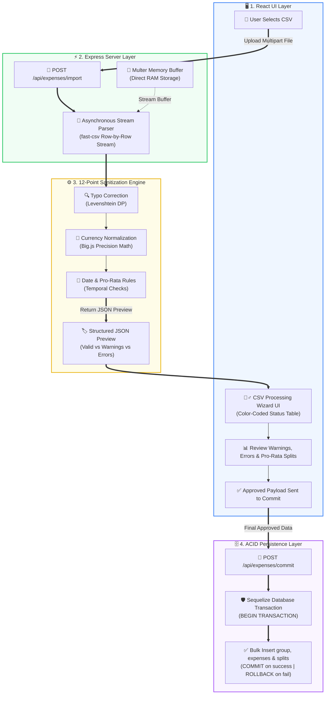

# 🏛️ Production-Ready CSV Ingestion & Sanitization Engine: Project Walkthrough

Welcome to the technical walkthrough of the **Financial CSV Ingestion & Sanitization Engine**. This project is designed to handle messy, human-generated expense sheets and convert them into mathematically precise, ACID-compliant ledger records.

This document is optimized to be presented to **Technical Interviewers** and **System Architects** to showcase clean code, deep engineering decisions, algorithm design, and database integrity.

---

## 🚀 1. The Core Engineering Challenges & Our Solutions

When building a financial parsing engine, standard CRUD paradigms fail due to real-world edge cases. Below is how we engineered solutions for the major financial and streaming challenges:

### 🔴 The Problem of IEEE 754 Floating-Point Drift
* **The Risk:** JavaScript numbers use floating-point binary representation. Doing split calculations like `100 / 3` results in `33.333333333333336`. Over thousands of transactions, fractional round-offs (penny drifts) create unbalanced ledgers, leading to auditing failures.
* **Our Solution:** We decoupled mathematical operations from native JS floats. All amounts and pro-rata weights are calculated using **`Big.js`** with **Banker’s Rounding (Half-Even)**. During database commits, we apply a **Zero-Sum Remainder-Absorption algorithm** where the final member absorbs any sub-cent rounding fractions, ensuring total splits sum exactly to `100.00%`.

### 🔴 Memory & Event-Loop Blocking
* **The Risk:** Reading large files synchronously via `readFileSync` blocks the single-threaded Node.js event loop. If multiple users upload files concurrently, the server freezes.
* **Our Solution:** We built an **asynchronous event-driven parsing pipeline**. The upload is handled via `multer.memoryStorage()`, keeping the file buffered in RAM (zero disk I/O latency). The buffer is then streamed row-by-row using **Node.js Readable Streams** directly into **`fast-csv`**, keeping the event loop non-blocking and responsive.

### 🔴 Dirty & Incomplete Human Data
* **The Risk:** Users make typos in names (e.g., `"Aihsa"` instead of `"Aisha"`), input mixed currency symbols (`$150`, `₹12,000`), or upload sheets containing transactions from months before a member joined the group.
* **Our Solution:** A **12-Point Sanitization Pipeline** that corrects names using the **Levenshtein Distance Dynamic Programming algorithm**, normalizes currencies via real-time exchange rates, checks dates against membership bounds, and recalculates pro-rata weights if members joined or left mid-month.

---

## 🎨 2. System Architecture & End-to-End Data Flow



---

## 🛠️ 3. Code Walkthrough: Deep-Dive Into Core Logic

Here are the key files and methods where the core engineering logic lives:

### 📍 1. The Entry Points (Routing & Multer Middleware)
* **File:** [expenseRoutes.js](file:///c:/Users/divya/OneDrive/Desktop/Expenses_App/backend/routes/expenseRoutes.js)
We set up a stateless file-import route. The file is uploaded as `multipart/form-data` and parsed directly in memory:
```javascript
const multer = require('multer');
const upload = multer({ storage: multer.memoryStorage() }); // RAM Buffering

// Ingestion route accepts a single file with name attribute 'file'
router.post('/import', protect, upload.single('file'), csvSanitizer.processCSV);
router.post('/commit', protect, csvSanitizer.commitData);
```

### 📍 2. The Ingestion Engine & Stream Parsing
* **File:** [csvSanitizer.js](file:///c:/Users/divya/OneDrive/Desktop/Expenses_App/backend/controllers/csvSanitizer.js)
Within `processCSV` (Line 61), we instantiate a stream from the RAM buffer to avoid saving the uploaded file to disk:
```javascript
const stream = Readable.from(req.file.buffer);

csv.parseStream(stream, { headers: true })
  .on('data', (row) => results.push(row))
  .on('end', () => {
     // Trigger 12-point sanitization pipeline on the collected rows...
  });
```

### 📍 3. Typo Correction using Levenshtein Distance
* **File:** [csvSanitizer.js](file:///c:/Users/divya/OneDrive/Desktop/Expenses_App/backend/controllers/csvSanitizer.js#L25)
To mapping mis-typed names to actual group members (e.g., `"meera"` vs `"mera"`), we implement Levenshtein distance using Dynamic Programming:
```javascript
const levenshtein = (a, b) => {
  if (a.length === 0) return b.length;
  if (b.length === 0) return a.length;
  const matrix = Array(a.length + 1).fill(null).map(() => Array(b.length + 1).fill(null));
  for (let i = 0; i <= a.length; i += 1) matrix[i][0] = i;
  for (let j = 0; j <= b.length; j += 1) matrix[0][j] = j;
  for (let i = 1; i <= a.length; i += 1) {
    for (let j = 1; j <= b.length; j += 1) {
      const indicator = a[i - 1] === b[j - 1] ? 0 : 1;
      matrix[i][j] = Math.min(
        matrix[i][j - 1] + 1,            // deletion
        matrix[i - 1][j] + 1,            // insertion
        matrix[i - 1][j - 1] + indicator // substitution
      );
    }
  }
  return matrix[a.length][b.length];
};
```
If the calculated distance is $\le 2$ edits, the system automatically corrects the spelling and flags a warning to the user.

### 📍 4. Zero-Sum Penny Rounding (Preventing Floating-Point Drift)
* **File:** [csvSanitizer.js](file:///c:/Users/divya/OneDrive/Desktop/Expenses_App/backend/controllers/csvSanitizer.js#L480)
When dividing amounts among participants, we calculate exact rounding values for the first $N-1$ users and assign the remainder to the last participant:
```javascript
let totalAllocated = Big(0);
for (let i = 0; i < validSplitMembers.length; i++) {
    // Round to 4 decimal places using Banker's Rounding
    let actualShareBig = baseAmountBig.div(validSplitMembers.length).round(4);

    // Final member absorbs any remainder
    if (i === validSplitMembers.length - 1) {
         actualShareBig = baseAmountBig.minus(totalAllocated).round(4);
    }
    totalAllocated = totalAllocated.plus(actualShareBig);
    
    await ExpenseSplit.create({ ... }, { transaction: t });
}
```

### 📍 5. ACID Database Transactions
* **File:** [csvSanitizer.js](file:///c:/Users/divya/OneDrive/Desktop/Expenses_App/backend/controllers/csvSanitizer.js#L407)
To ensure database integrity, we wrap the bulk insertion logic in a transaction. If any split insert fails, the database rolls back to its pre-import state:
```javascript
const t = await sequelize.transaction();
try {
   // 1. Bulk create Expenses
   // 2. Bulk create splits
   await t.commit();
} catch (error) {
   await t.rollback(); // Rollback everything on failure
   res.status(500).json({ error: 'Database transaction failed.' });
}
```

---

## 🖥️ 4. Interactive Frontend User Experience (UX)
* **File:** [CSVProcessingWizard.jsx](file:///c:/Users/divya/OneDrive/Desktop/Expenses_App/frontend/src/components/CSVProcessingWizard.jsx)

To guarantee high data quality, we use a **Human-in-the-Loop** model. The UI helps the user correct mistakes before committing:
* **Interactive Editing:** Users can double-click table cells to edit incorrect payloads directly in the browser.
* **Pro-Rata Custom View:** Shows temporal exclusions (if someone was not active during the expense period).
* **Validation Shields:** The "Commit to Database" button remains disabled as long as there is even a single row with an unresolved **`error`** state.

---

## 🎯 5. Core Interview Q&A Cheatsheet

#### Q1: "How would this handle scaling to a 5GB CSV file?"
> **Answer:** *"Currently, we use memory storage for standard group expense files (which are small). For 5GB files, we would swap out `multer.memoryStorage()` for **direct-to-disk streaming** or **pre-signed S3 upload links**. The backend would read the stream chunk-by-chunk using worker threads or task queues (like BullMQ/Redis) and run batch database inserts in groups of 1,000 to keep database connections open and fast."*

#### Q2: "Why use Levenshtein distance manually instead of a database `LIKE` query or fuzzy search index?"
> **Answer:** *"Database queries like `LIKE` or native fuzzy indexes are expensive and introduce database latency. Since group membership is bounded (usually 5 to 20 users per group), we can fetch the active members list once and calculate the edit distance in RAM in sub-milliseconds, preventing database load."*

#### Q3: "What is Banker's Rounding, and why is it preferred here?"
> **Answer:** *"Standard rounding always rounds 0.5 upwards, which introduces a positive statistical bias over large volumes of transactions. Banker's Rounding (Half-Even rounding) rounds to the nearest even number when it is exactly half (e.g., both 1.5 and 2.5 round to 2). This balances out rounding directions across thousands of entries, minimizing cumulative drift."*
